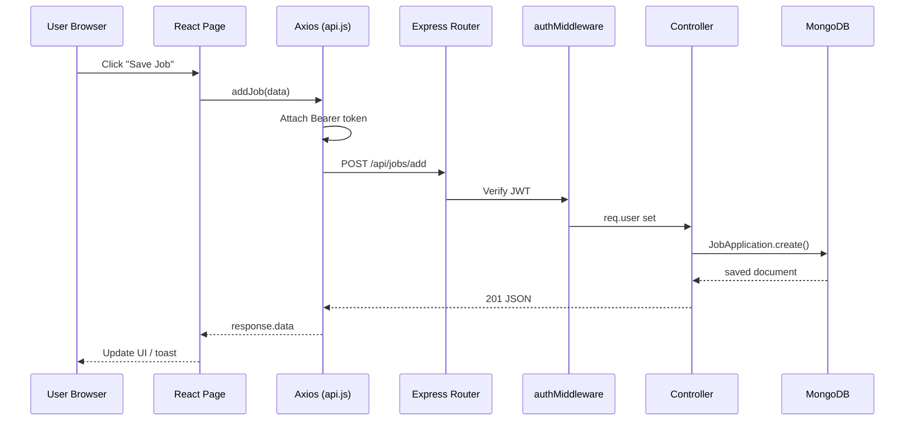

# AI Job Application Tracker (JobTracker AI)
## Complete MERN Stack Architecture Reference

**Project name:** AI Job Application Tracker (JobTracker AI)  
**Stack:** React 19 · Vite · Tailwind CSS v4 · Axios · Node.js · Express 5 · MongoDB · Mongoose · JWT  
**Document version:** 1.0 · May 2026  
**Authoring context:** Principal Full Stack architecture guide aligned to the current repository.

---

## Table of Contents

1. [Phase 1 — System Architecture & File Tree](#phase-1--system-architecture--file-tree)
2. [Phase 2 — Backend Architecture & Data Layer](#phase-2--backend-architecture--data-layer)
3. [Phase 3 — Frontend Architecture & API Integration](#phase-3--frontend-architecture--api-integration)
4. [Phase 4 — Step-by-Step Execution Guide (Data Flow)](#phase-4--step-by-step-execution-guide-data-flow)
5. [API Reference Summary](#api-reference-summary)
6. [Environment Variables](#environment-variables)
7. [Production Hardening Checklist](#production-hardening-checklist)

---

# PHASE 1 — System Architecture & File Tree

## 1.1 High-Level System Diagram

```
┌─────────────────────────────────────────────────────────────────────────────┐
│                           CLIENT (Browser)                                   │
│  React 19 + Vite + Tailwind CSS + React Router + Axios + localStorage JWT   │
└───────────────────────────────────┬─────────────────────────────────────────┘
                                    │ HTTPS / HTTP
                                    │ JSON + multipart/form-data (resume PDF)
                                    ▼
┌─────────────────────────────────────────────────────────────────────────────┐
│                    API GATEWAY LAYER (Express 5)                             │
│  server.js → CORS → express.json() → Route Mounts (/api/auth|jobs|ai)       │
└───────────────────────────────────┬─────────────────────────────────────────┘
                                    │
          ┌─────────────────────────┼─────────────────────────┐
          ▼                         ▼                         ▼
   ┌──────────────┐         ┌──────────────┐         ┌──────────────┐
   │ authRoutes   │         │ jobRoutes    │         │ aiRoutes     │
   │ (public)     │         │ + auth MW    │         │ + auth MW    │
   └──────┬───────┘         └──────┬───────┘         │ + multer     │
          │                        │                 └──────┬───────┘
          ▼                        ▼                        ▼
   ┌──────────────┐         ┌──────────────┐         ┌──────────────┐
   │ authController│        │ jobController│         │ aiController │
   └──────┬───────┘         └──────┬───────┘         └──────┬───────┘
          │                        │                        │
          │                        │                 ┌──────▼───────┐
          │                        │                 │  aiService   │
          │                        │                 │ (heuristic)  │
          ▼                        ▼                 └──────────────┘
   ┌──────────────────────────────────────────────────────────────────┐
   │                     DATA LAYER (Mongoose / MongoDB)               │
   │   User  ·  JobApplication  ·  ResumeAnalysis                    │
   └──────────────────────────────────────────────────────────────────┘
```

## 1.2 MVC Mapping (Strict Separation)

| MVC Layer | Backend Location | Responsibility |
|-----------|------------------|----------------|
| **Model** | `backend/models/*.js` | Mongoose schemas, validations, indexes, references |
| **View** | N/A (JSON API) | Express returns JSON; React is the presentation layer |
| **Controller** | `backend/controllers/*.js` | Request validation, orchestration, HTTP status codes |
| **Routes** | `backend/routes/*.js` | URL → middleware chain → controller binding |
| **Middleware** | `backend/middleware/*.js` | JWT auth, (optional) RBAC, error wrappers |
| **Services** | `backend/services/*.js` | Domain logic decoupled from HTTP (AI scoring) |
| **Config** | `backend/config/*.js` | DB connection, Multer upload rules |

| Frontend Concern | Location | Responsibility |
|------------------|----------|----------------|
| **Pages** | `frontend/src/pages/` | Route-level screens (Dashboard, Jobs, etc.) |
| **Components** | `frontend/src/components/` | Reusable UI (Navbar, ProtectedRoute, Toasts) |
| **Layouts** | `frontend/src/layouts/` | Shell wrapping pages (Navbar + Footer) |
| **Services** | `frontend/src/services/` | Axios API wrappers (`api.js`, `auth.js`, `job.js`) |
| **Context** | `frontend/src/context/` | Global UI state (theme) |
| **Hooks** | `frontend/src/hooks/` | Reusable React hooks (`useTheme`) |

## 1.3 Production-Ready Directory Tree (Current + Recommended)

```
AI-Job-Application-Tracker/
│
├── README.md
├── docs/
│   └── ARCHITECTURE_COMPLETE.md          ← This file (downloadable reference)
│
├── backend/
│   ├── server.js                         ← Entry point: CORS, JSON, routes, listen
│   ├── package.json
│   ├── .env                              ← PORT, MONGO_URI, JWT_SECRET (not committed)
│   │
│   ├── config/
│   │   ├── db.js                         ← Mongoose connection
│   │   └── multer.js                     ← PDF upload → disk → cleanup in controller
│   │
│   ├── models/                           ← MODEL LAYER
│   │   ├── User.js
│   │   ├── JobApplication.js
│   │   └── ResumeAnalysis.js
│   │
│   ├── controllers/                      ← CONTROLLER LAYER
│   │   ├── authController.js             ← register, login
│   │   ├── jobController.js              ← CRUD + dashboard stats
│   │   └── aiController.js               ← resume analyze, skill gap
│   │
│   ├── routes/                           ← ROUTE LAYER (thin)
│   │   ├── authRoutes.js
│   │   ├── jobRoutes.js
│   │   └── aiRoutes.js
│   │
│   ├── middleware/
│   │   ├── authMiddleware.js             ← JWT Bearer verification
│   │   └── roleMiddleware.js             ← [RECOMMENDED] RBAC guard
│   │
│   ├── services/
│   │   └── aiService.js                  ← Heuristic ATS keyword engine
│   │
│   ├── uploads/                          ← Ephemeral PDF storage (cleaned after parse)
│   └── utils/
│       └── errorHandler.js               ← [RECOMMENDED] Central error middleware
│
└── frontend/
    ├── index.html
    ├── vite.config.js
    ├── package.json
    ├── .env                              ← VITE_API_URL
    │
    ├── public/
    │   └── icons.svg
    │
    └── src/
        ├── main.jsx                      ← React root, Router, ThemeProvider
        ├── App.jsx                       ← Route definitions
        ├── index.css                     ← Tailwind + global tokens
        │
        ├── layouts/
        │   └── MainLayout.jsx            ← Navbar + main + Footer
        │
        ├── pages/                        ← One file per route
        │   ├── Home.jsx
        │   ├── Login.jsx
        │   ├── Register.jsx
        │   ├── Dashboard.jsx
        │   ├── Jobs.jsx
        │   ├── AddJob.jsx
        │   └── ResumeUpload.jsx
        │
        ├── components/
        │   ├── Navbar.jsx
        │   ├── Footer.jsx
        │   ├── ProtectedRoute.jsx
        │   └── AppToasts.jsx
        │
        ├── context/                      ← [OPTIONAL] AuthContext for session
        │   ├── themeContext.js
        │   └── ThemeProvider.jsx
        │
        ├── hooks/
        │   └── useTheme.js
        │
        └── services/                     ← API LAYER
            ├── api.js                    ← Axios instance + interceptors
            ├── auth.js
            └── job.js
```

## 1.4 Request Routing Map

| HTTP | Endpoint | Auth | Controller |
|------|----------|------|------------|
| POST | `/api/auth/register` | Public | `register` |
| POST | `/api/auth/login` | Public | `login` |
| POST | `/api/jobs/add` | JWT | `addJob` |
| GET | `/api/jobs/all` | JWT | `getJobs` |
| PUT | `/api/jobs/update/:id` | JWT | `updateJob` |
| DELETE | `/api/jobs/delete/:id` | JWT | `deleteJob` |
| GET | `/api/jobs/dashboard` | JWT | `getDashboardStats` |
| POST | `/api/ai/analyze` | JWT + Multer | `analyzeResume` |
| POST | `/api/ai/skill-gap` | JWT | `skillGapAnalysis` |

---

# PHASE 2 — Backend Architecture & Data Layer

## 2.1 Mongoose Schemas (Current + Enhanced Reference)

### User Model

**Current file:** `backend/models/User.js`

**Enhancement for RBAC:** add `role` field with enum and index.

```javascript
const mongoose = require("mongoose");

const ROLES = ["user", "admin"];

const UserSchema = new mongoose.Schema(
  {
    name: {
      type: String,
      required: [true, "Name is required"],
      trim: true,
      maxlength: [80, "Name cannot exceed 80 characters"],
    },
    email: {
      type: String,
      required: [true, "Email is required"],
      unique: true,
      lowercase: true,
      trim: true,
      match: [/^\S+@\S+\.\S+$/, "Please provide a valid email"],
    },
    password: {
      type: String,
      required: [true, "Password is required"],
      minlength: [8, "Password must be at least 8 characters"],
      select: false, // never return password in queries by default
    },
    role: {
      type: String,
      enum: ROLES,
      default: "user",
      index: true,
    },
  },
  { timestamps: true }
);

// Index: login lookups by email (unique already creates index)
UserSchema.index({ email: 1 });

module.exports = mongoose.model("User", UserSchema);
module.exports.ROLES = ROLES;
```

### JobApplication Model

**Current file:** `backend/models/JobApplication.js`

```javascript
const mongoose = require("mongoose");

const STATUS_ENUM = ["Applied", "Interviewing", "Offered", "Rejected"];

const jobSchema = new mongoose.Schema(
  {
    userId: {
      type: mongoose.Schema.Types.ObjectId,
      ref: "User",
      required: true,
      index: true, // fast per-user queries
    },
    companyName: { type: String, trim: true, maxlength: 120 },
    role: { type: String, trim: true, maxlength: 120 },
    jobLink: { type: String, trim: true },
    status: {
      type: String,
      enum: STATUS_ENUM,
      default: "Applied",
    },
    notes: { type: String, maxlength: 2000 },
  },
  { timestamps: true }
);

// Compound index: user's jobs filtered by status (dashboard)
jobSchema.index({ userId: 1, status: 1 });
jobSchema.index({ userId: 1, createdAt: -1 });

module.exports = mongoose.model("JobApplication", jobSchema);
module.exports.STATUS_ENUM = STATUS_ENUM;
```

### ResumeAnalysis Model

**Current file:** `backend/models/ResumeAnalysis.js`

```javascript
const mongoose = require("mongoose");

const resumeSchema = new mongoose.Schema(
  {
    userId: {
      type: mongoose.Schema.Types.ObjectId,
      ref: "User",
      required: true,
      index: true,
    },
    resumeText: { type: String },
    jobDescription: { type: String, default: "" },
    atsScore: { type: Number, default: 0, min: 0, max: 100 },
    missingSkills: [{ type: String }],
    skillsToAdd: [{ type: String }],
    summary: { type: String, default: "" },
    keyChanges: { type: String, default: "" },
    suggestions: { type: String },
  },
  { timestamps: true }
);

resumeSchema.index({ userId: 1, createdAt: -1 });

module.exports = mongoose.model("ResumeAnalysis", resumeSchema);
```

## 2.2 Authentication & Authorization Middleware

### JWT Verification (Current)

**File:** `backend/middleware/authMiddleware.js`

Flow:
1. Read `Authorization: Bearer <token>` header.
2. `jwt.verify(token, JWT_SECRET)` → attach `req.user = decoded.userId`.
3. On failure → `401`.

```javascript
const jwt = require("jsonwebtoken");

const authMiddleware = (req, res, next) => {
  try {
    const authHeader = req.headers.authorization;
    if (!authHeader || !authHeader.startsWith("Bearer ")) {
      return res.status(401).json({ message: "No token, authorization denied" });
    }

    const token = authHeader.split(" ")[1];
    const decoded = jwt.verify(token, process.env.JWT_SECRET);

    req.user = decoded.userId;
    if (decoded.role) req.userRole = decoded.role; // when RBAC enabled in JWT payload

    next();
  } catch (error) {
    console.error("Auth middleware:", error.message);
    return res.status(401).json({ message: "Invalid or expired token" });
  }
};

module.exports = authMiddleware;
```

### RBAC Role Verification (Recommended)

**File:** `backend/middleware/roleMiddleware.js`

```javascript
/**
 * Factory: restrict route to one or more roles.
 * Usage: router.get("/admin", authMiddleware, authorizeRoles("admin"), handler)
 */
const authorizeRoles = (...allowedRoles) => {
  return (req, res, next) => {
    try {
      if (!req.userRole) {
        return res.status(403).json({ message: "Role information missing from token" });
      }
      if (!allowedRoles.includes(req.userRole)) {
        return res.status(403).json({ message: "Access denied for this role" });
      }
      next();
    } catch (error) {
      return res.status(500).json({ message: "Authorization error", error: error.message });
    }
  };
};

module.exports = { authorizeRoles };
```

**JWT payload with role (update authController):**

```javascript
const token = jwt.sign(
  { userId: user._id, role: user.role || "user" },
  process.env.JWT_SECRET,
  { expiresIn: "7d" }
);
```

### HttpOnly Cookie Alternative (Optional)

For cookie-based JWT instead of `localStorage`:

```javascript
// authController login/register response
res.cookie("token", token, {
  httpOnly: true,
  secure: process.env.NODE_ENV === "production",
  sameSite: "strict",
  maxAge: 7 * 24 * 60 * 60 * 1000,
});

// authMiddleware reads cookie
const token = req.cookies?.token;
```

Frontend: `axios.create({ withCredentials: true })` and remove localStorage token logic.

## 2.3 Controller Patterns (Representative)

### Auth Controller (Current + Hardened)

```javascript
const User = require("../models/User.js");
const bcrypt = require("bcrypt");
const jwt = require("jsonwebtoken");

exports.register = async (req, res) => {
  try {
    const { name, email, password } = req.body;
    if (!name || !email || !password) {
      return res.status(400).json({ message: "All fields are required" });
    }

    const existingUser = await User.findOne({ email: email.toLowerCase() });
    if (existingUser) {
      return res.status(400).json({ message: "User already exists" });
    }

    const hashedPassword = await bcrypt.hash(password, 10);
    const user = await User.create({ name, email, password: hashedPassword });

    const token = jwt.sign(
      { userId: user._id, role: user.role || "user" },
      process.env.JWT_SECRET,
      { expiresIn: "7d" }
    );

    return res.status(201).json({
      message: "User registered successfully",
      token,
      user: { id: user._id, name: user.name, email: user.email, role: user.role },
    });
  } catch (error) {
    console.error("register:", error.message);
    return res.status(500).json({ message: "Error registering user", error: error.message });
  }
};

exports.login = async (req, res) => {
  try {
    const { email, password } = req.body;
    if (!email || !password) {
      return res.status(400).json({ message: "Email and password are required" });
    }

    const user = await User.findOne({ email: email.toLowerCase() }).select("+password");
    if (!user) {
      return res.status(400).json({ message: "Invalid credentials" });
    }

    const isMatch = await bcrypt.compare(password, user.password);
    if (!isMatch) {
      return res.status(400).json({ message: "Invalid credentials" });
    }

    const token = jwt.sign(
      { userId: user._id, role: user.role || "user" },
      process.env.JWT_SECRET,
      { expiresIn: "7d" }
    );

    return res.json({
      message: "Login successful",
      token,
      user: { id: user._id, name: user.name, email: user.email, role: user.role },
    });
  } catch (error) {
    console.error("login:", error.message);
    return res.status(500).json({ message: "Error logging in", error: error.message });
  }
};
```

### Job Controller — Ownership Guard (Recommended)

Prevent users from updating/deleting another user's jobs:

```javascript
exports.updateJob = async (req, res) => {
  try {
    const job = await JobApplication.findOne({ _id: req.params.id, userId: req.user });
    if (!job) {
      return res.status(404).json({ message: "Job not found or access denied" });
    }

    Object.assign(job, req.body);
    await job.save();

    return res.json({ message: "Job application updated successfully", job });
  } catch (error) {
    return res.status(500).json({ message: "Error updating job", error: error.message });
  }
};
```

### AI Controller — Multer + Cleanup (Current Pattern)

**Key behaviors in `aiController.js`:**
1. Accept PDF via `upload.single("resume")` or raw `resumeText` in body.
2. Parse PDF with `pdf-parse`.
3. Call `aiService(resumeText, jobDescription)` for heuristic ATS score.
4. Persist `ResumeAnalysis` document.
5. **`finally` block:** `fs.unlinkSync` uploaded file (instant storage cleanup).

## 2.4 Central Server Entry (Enhanced Reference)

**Current:** `backend/server.js`  
**Recommended additions:** helmet, rate limiting, centralized error handler, stricter CORS.

```javascript
require("dotenv").config();
const express = require("express");
const cors = require("cors");
const connectDB = require("./config/db.js");

const authRoutes = require("./routes/authRoutes.js");
const jobRoutes = require("./routes/jobRoutes.js");
const aiRoutes = require("./routes/aiRoutes.js");

const app = express();

// --- Security & parsing ---
app.use(
  cors({
    origin: process.env.CLIENT_URL || "http://localhost:5173",
    credentials: true, // required if using HttpOnly cookies
  })
);
app.use(express.json({ limit: "1mb" }));
app.use(express.urlencoded({ extended: true }));

// --- Health check ---
app.get("/", (req, res) => {
  res.json({ status: "ok", service: "AI Job Tracker API" });
});

// --- API routes ---
app.use("/api/auth", authRoutes);
app.use("/api/jobs", jobRoutes);
app.use("/api/ai", aiRoutes);

// --- 404 handler ---
app.use((req, res) => {
  res.status(404).json({ message: `Route not found: ${req.method} ${req.originalUrl}` });
});

// --- Global error handler ---
app.use((err, req, res, next) => {
  console.error("Unhandled error:", err.message);
  const status = err.statusCode || 500;
  res.status(status).json({
    message: err.message || "Internal server error",
    ...(process.env.NODE_ENV === "development" && { stack: err.stack }),
  });
});

const PORT = process.env.PORT || 5000;

const start = async () => {
  try {
    await connectDB();
    app.listen(PORT, () => console.log(`Server running on port ${PORT}`));
  } catch (err) {
    console.error("Failed to start server:", err.message);
    process.exit(1);
  }
};

start();
```

## 2.5 AI Service Layer

**File:** `backend/services/aiService.js`

- Maintains `TECH_KEYWORDS` catalogue.
- `findKeywordsInText()` — substring match in lowercase.
- `compareResumeToJob()` — computes `atsScore`, `missingSkills`, `skillsToAdd`, narrative `summary`, `keyChanges`, `suggestions`.
- No external API dependency (offline, fast, predictable).
- Optional future: swap implementation to OpenAI/Hugging Face behind same function signature.

---

# PHASE 3 — Frontend Architecture & API Integration

## 3.1 Routing & Layout

**Bootstrap:** `frontend/src/main.jsx`

```
StrictMode
 └── ThemeProvider
      └── BrowserRouter
           ├── App (routes inside MainLayout)
           └── AppToasts (react-toastify)
```

**Routes:** `frontend/src/App.jsx`

| Path | Access | Page |
|------|--------|------|
| `/` | Public | Home |
| `/login` | Public | Login |
| `/register` | Public | Register |
| `/dashboard` | Protected | Dashboard |
| `/jobs` | Protected | Jobs list |
| `/add-job` | Protected | Add job form |
| `/resume` | Protected | Resume upload + AI analysis |

**Protected wrapper:** `ProtectedRoute.jsx` checks `localStorage.token`; redirects to `/login` with `state.from` for post-login return.

### Role-Restricted Route (Recommended)

```jsx
// components/RoleRoute.jsx
import { Navigate } from "react-router-dom";

export default function RoleRoute({ children, allowedRoles = [] }) {
  const token = localStorage.getItem("token");
  const user = JSON.parse(localStorage.getItem("user") || "null");

  if (!token) return <Navigate to="/login" replace />;
  if (allowedRoles.length && !allowedRoles.includes(user?.role)) {
    return <Navigate to="/dashboard" replace />;
  }
  return children;
}

// Usage in App.jsx
<Route
  path="/admin"
  element={
    <RoleRoute allowedRoles={["admin"]}>
      <AdminPanel />
    </RoleRoute>
  }
/>
```

## 3.2 Axios Instance & Interceptors

**File:** `frontend/src/services/api.js` (current implementation)

```javascript
import axios from "axios";

let apiURL = import.meta.env.VITE_API_URL || "http://localhost:5000/api";
if (!apiURL.endsWith("/api")) {
  apiURL = apiURL.replace(/\/$/, "") + "/api";
}

const API = axios.create({
  baseURL: apiURL,
  timeout: 30000,
});

// Request: attach JWT
API.interceptors.request.use(
  (config) => {
    const token = localStorage.getItem("token");
    if (token) {
      config.headers.Authorization = `Bearer ${token}`;
    }
    return config;
  },
  (error) => Promise.reject(error)
);

// Response: global error handling
API.interceptors.response.use(
  (response) => response,
  (error) => {
    const status = error.response?.status;
    const message = error.response?.data?.message || error.message;

    if (status === 401) {
      localStorage.removeItem("token");
      localStorage.removeItem("user");
      if (!window.location.pathname.includes("/login")) {
        window.location.href = "/login";
      }
    }

    return Promise.reject({ status, message, raw: error });
  }
);

export default API;
```

**Service modules:**
- `auth.js` → `loginUser`, `registerUser`
- `job.js` → `addJob`, `getJobs`, `updateJob`, `deleteJob`

**Resume upload (multipart):**

```javascript
// services/ai.js
import API from "./api";

export const analyzeResume = (formData) =>
  API.post("/ai/analyze", formData, {
    headers: { "Content-Type": "multipart/form-data" },
  });
```

## 3.3 Global Session State (Recommended AuthContext)

Current app stores session in `localStorage` per page. Recommended pattern:

```javascript
// context/AuthContext.jsx
import { createContext, useContext, useState, useEffect } from "react";
import { loginUser, registerUser } from "../services/auth";

const AuthContext = createContext(null);

export function AuthProvider({ children }) {
  const [user, setUser] = useState(() => {
    const saved = localStorage.getItem("user");
    return saved ? JSON.parse(saved) : null;
  });
  const [token, setToken] = useState(() => localStorage.getItem("token"));
  const [loading, setLoading] = useState(false);

  const persistSession = (newToken, newUser) => {
    setToken(newToken);
    setUser(newUser);
    localStorage.setItem("token", newToken);
    localStorage.setItem("user", JSON.stringify(newUser));
  };

  const login = async (credentials) => {
    setLoading(true);
    try {
      const { data } = await loginUser(credentials);
      persistSession(data.token, data.user);
      return data;
    } finally {
      setLoading(false);
    }
  };

  const logout = () => {
    setToken(null);
    setUser(null);
    localStorage.removeItem("token");
    localStorage.removeItem("user");
  };

  const isAuthenticated = Boolean(token);

  return (
    <AuthContext.Provider value={{ user, token, loading, login, logout, isAuthenticated }}>
      {children}
    </AuthContext.Provider>
  );
}

export const useAuth = () => useContext(AuthContext);
```

**Theme (existing):** `ThemeProvider` + `useTheme` for dark/light mode via `themeContext.js`.

---

# PHASE 4 — Step-by-Step Execution Guide (Data Flow)

## 4.1 Example A: User Logs In

```
┌──────────┐    1. submit form     ┌─────────────┐
│ Login.jsx│ ───────────────────► │ auth.js     │
└──────────┘                      │ API.post    │
                                  └──────┬──────┘
                                         │ 2. POST /api/auth/login
                                         ▼
                                  ┌─────────────┐
                                  │ authRoutes  │
                                  └──────┬──────┘
                                         │ 3. authController.login
                                         ▼
                                  ┌─────────────┐
                                  │ User.findOne│
                                  │ bcrypt.compare
                                  │ jwt.sign    │
                                  └──────┬──────┘
                                         │ 4. { token, user }
                                         ▼
┌──────────┐    5. localStorage     ┌─────────────┐
│ Login.jsx│ ◄─────────────────── │ Axios resp  │
└──────────┘    navigate /dashboard └─────────────┘
```

**Steps:**
1. User enters email/password → `handleSubmit` in `Login.jsx`.
2. `loginUser({ email, password })` calls Axios `POST /auth/login`.
3. Express routes to `authController.login` (no auth middleware).
4. Controller validates user, compares hash, signs JWT with `userId`.
5. Frontend stores `token` + `user` in `localStorage`, navigates to `/dashboard`.
6. Subsequent requests: interceptor adds `Authorization: Bearer <token>`.

## 4.2 Example B: Add Job Application (Protected)

```
UI (AddJob.jsx)
  → job.addJob(payload)
  → Axios POST /jobs/add + Bearer token
  → jobRoutes: authMiddleware
      → jwt.verify → req.user = userId
  → jobController.addJob
      → JobApplication.create({ ...body, userId: req.user })
  → MongoDB insert
  → 201 { job }
  → UI toast + redirect /jobs
```

## 4.3 Example C: Resume PDF Analysis (File + AI)

```
UI (ResumeUpload.jsx)
  → FormData: resume (file), jobDescription (field)
  → POST /ai/analyze (multipart)
  → aiRoutes: authMiddleware → multer.single("resume")
  → aiController.analyzeResume
      → read PDF buffer → pdf-parse → resumeText
      → aiService(resumeText, jobDescription)  // heuristic score
      → ResumeAnalysis.create(...)
      → finally: fs.unlinkSync(uploaded PDF)
  → JSON { analysis }
  → UI renders atsScore, missingSkills, suggestions
```

## 4.4 Sequence Diagram (End-to-End Protected Request)



## 4.5 Error Propagation Contract

| Layer | On failure |
|-------|------------|
| Mongoose validation | Controller catch → `400/500` + `error.message` |
| JWT invalid/expired | `authMiddleware` → `401` |
| Wrong role | `authorizeRoles` → `403` |
| Missing file/text | `aiController` → `400` |
| Axios interceptor | Clear token on `401`, redirect login |
| UI | `react-toastify` via `AppToasts` |

---

# API Reference Summary

## Auth
- `POST /api/auth/register` — body: `{ name, email, password }`
- `POST /api/auth/login` — body: `{ email, password }`

## Jobs (Bearer required)
- `POST /api/jobs/add` — body: `{ companyName, role, jobLink, notes, status? }`
- `GET /api/jobs/all`
- `PUT /api/jobs/update/:id`
- `DELETE /api/jobs/delete/:id`
- `GET /api/jobs/dashboard` — returns `{ total, interviews, offers, rejected }`

## AI (Bearer required)
- `POST /api/ai/analyze` — `multipart/form-data`: `resume` (file), `jobDescription` (string)
- `POST /api/ai/skill-gap` — body: `{ jobDescription }`

---

# Environment Variables

## Backend (`backend/.env`)
```env
PORT=5000
MONGO_URL=mongodb://127.0.0.1:27017/jobtracker
# or MONGODB_URI for Atlas
JWT_SECRET=your_long_random_secret
CLIENT_URL=http://localhost:5173
NODE_ENV=development
```

## Frontend (`frontend/.env`)
```env
VITE_API_URL=http://localhost:5000/api
```

---

# Production Hardening Checklist

- [ ] Add `role` to User schema + `authorizeRoles` middleware
- [ ] Scope job update/delete by `userId` (prevent IDOR)
- [ ] Use `helmet`, `express-rate-limit` on `/api/auth`
- [ ] Prefer HttpOnly cookies over `localStorage` for XSS resilience
- [ ] Validate file MIME type and max size in Multer
- [ ] Add `dashboard` stats endpoint to `job.js` frontend service
- [ ] Centralize Axios 401 handling (already sketched in Phase 3)
- [ ] MongoDB indexes on `userId`, `email`, compound `{ userId, status }`
- [ ] Structured logging (pino/winston) instead of `console.log` only

---

## Document Footer

This architecture document reflects the **AI Job Application Tracker** repository as implemented, with production-grade extensions clearly marked as **Recommended**. Use this file as the single source of truth for onboarding, reviews, and scaling the MERN stack.

**Download:** Save or export `docs/ARCHITECTURE_COMPLETE.md` from your project root.
